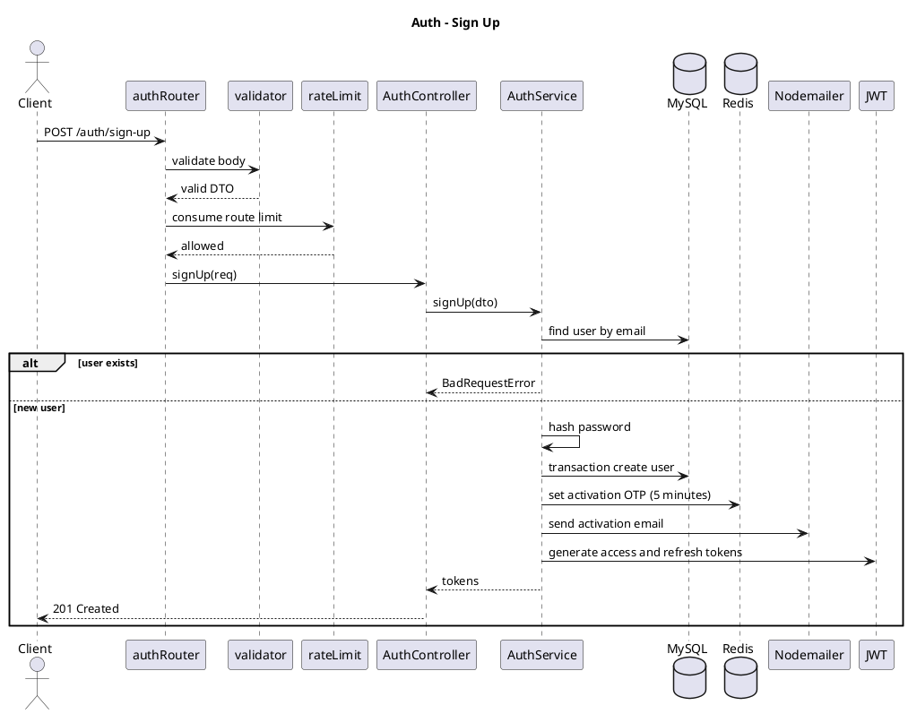
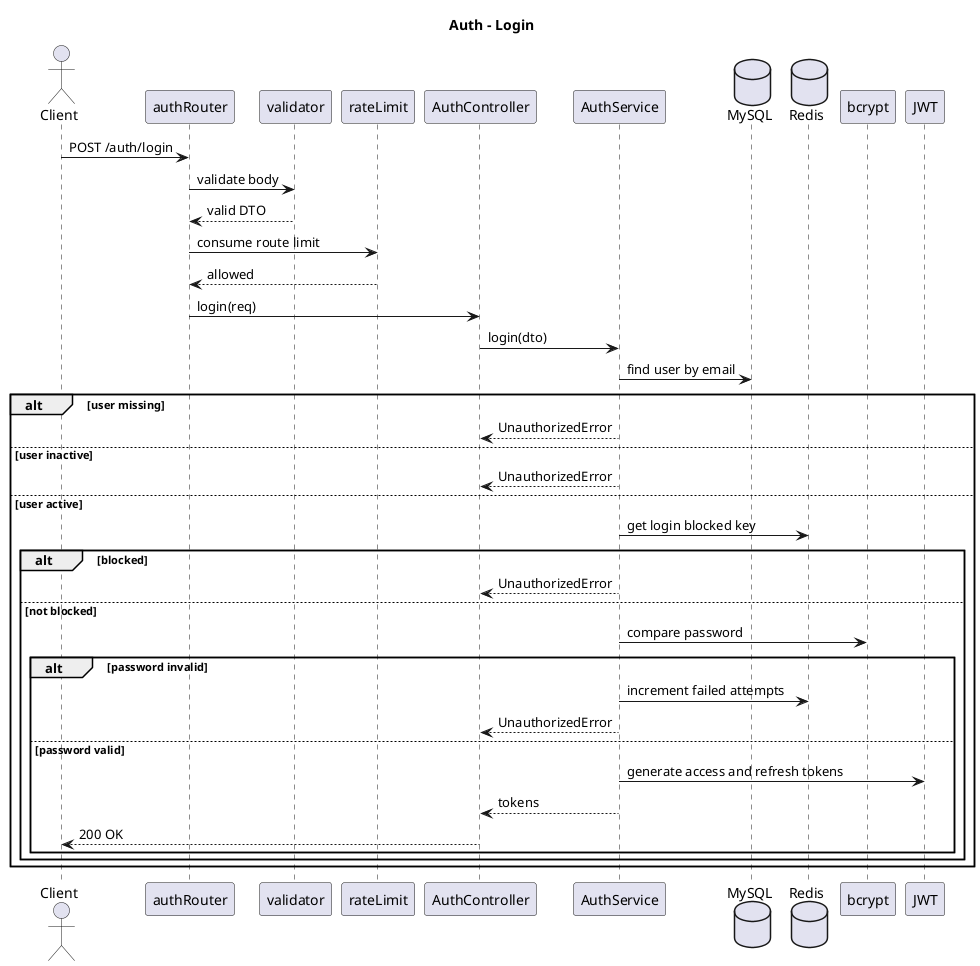
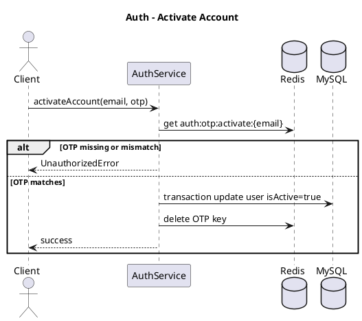
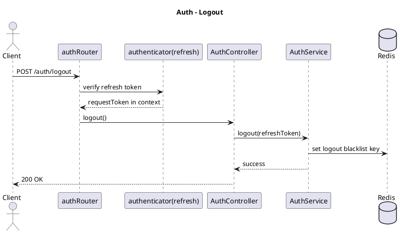
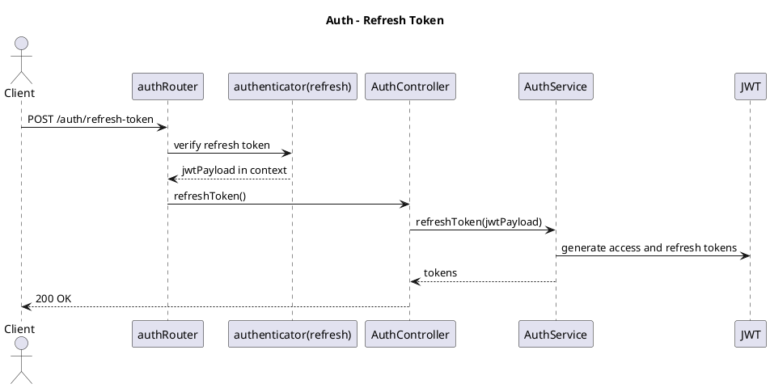
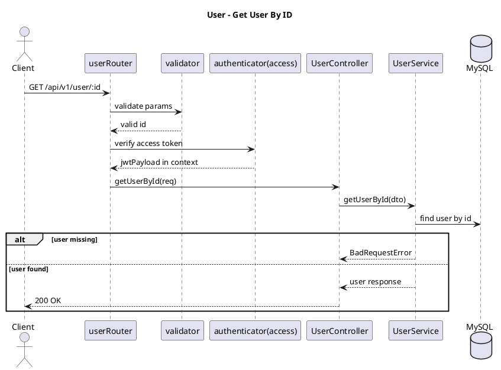
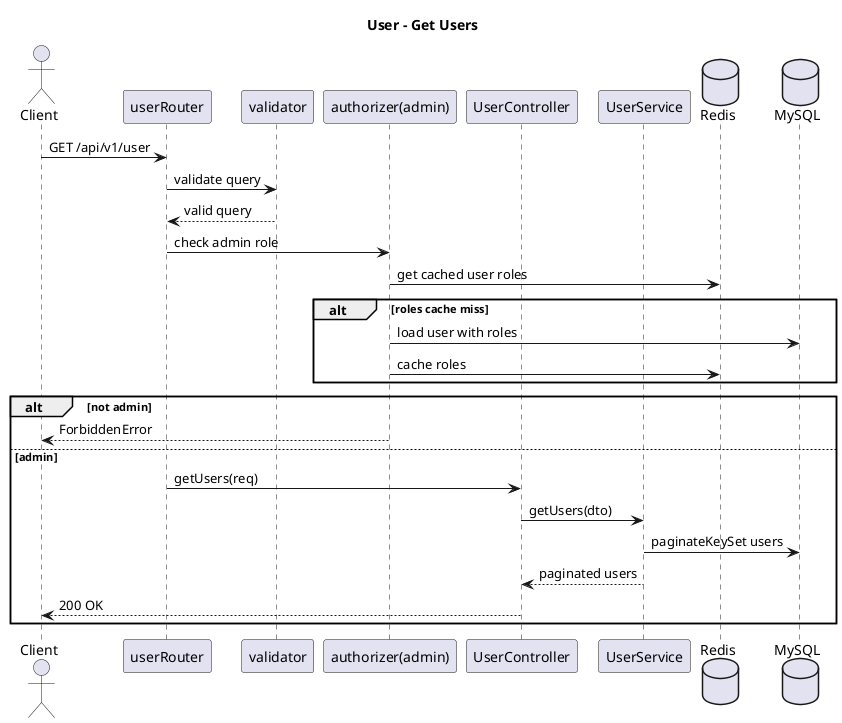
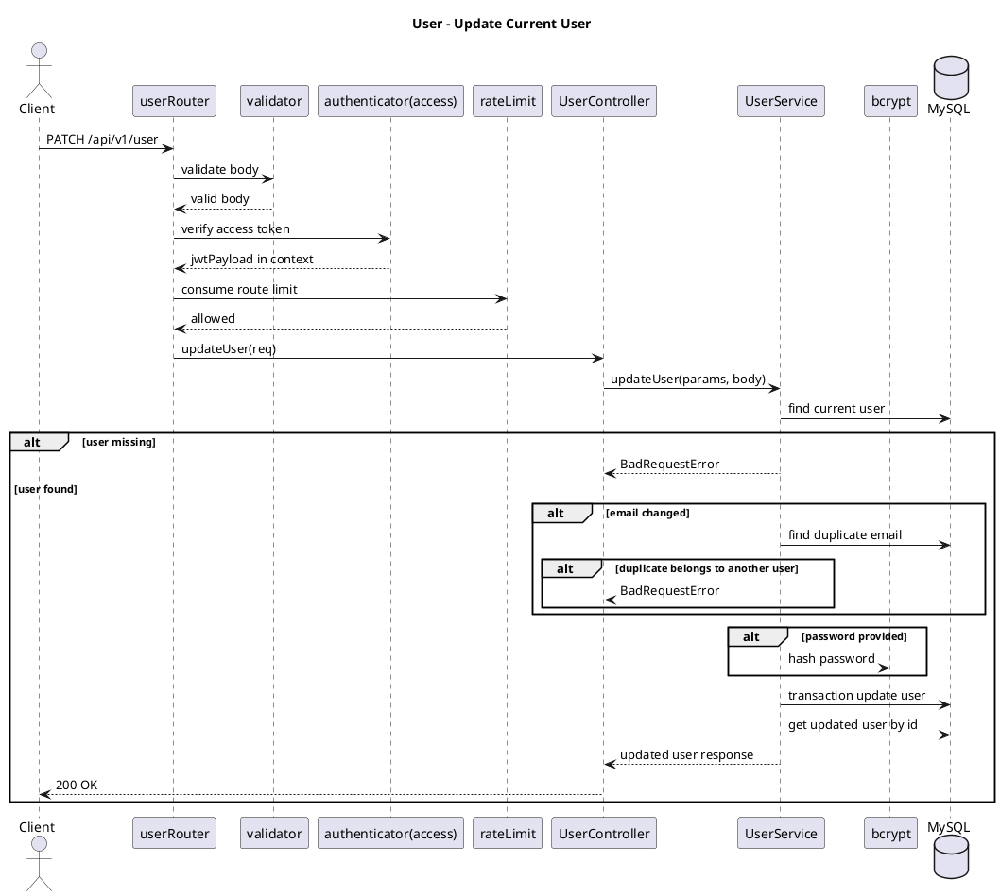
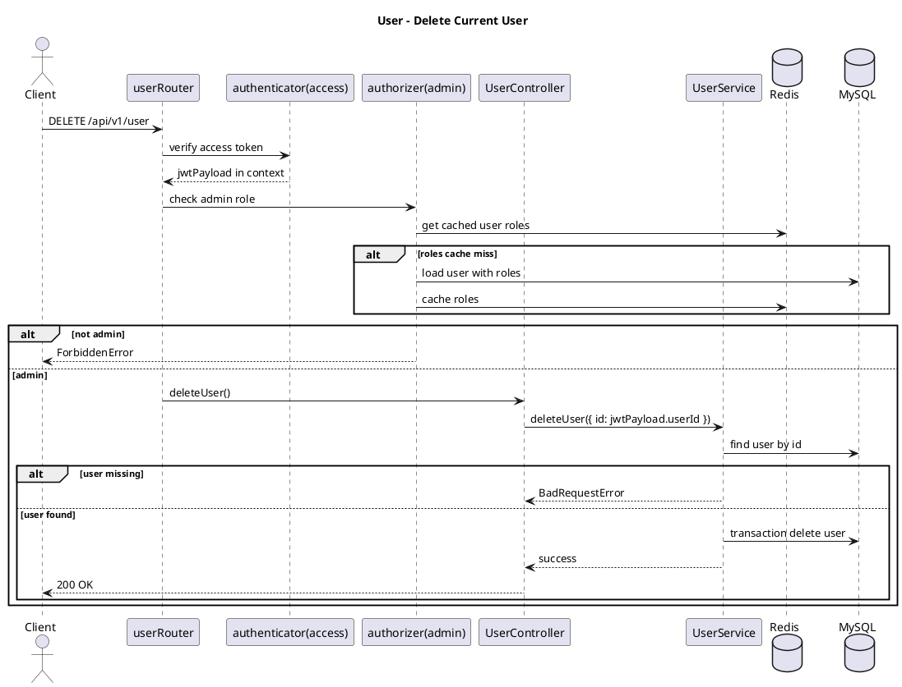

# Auth And User Use Cases

This document summarizes the implemented auth and user flows in `src/api/auth` and `src/api/user`.

Routing note: `authRouter` defines auth routes, but `src/api/app.router.ts` currently mounts only `health_check` and `user` under `/api/v1`. The auth route paths below are based on the module router shape and require mounting `authRouter` before they are reachable.

## Auth Use Cases

### Sign Up

- Defined route: `POST /auth/sign-up`
- Validation: `signUpRequestSchema`
- Rate limit: route scoped, limit `5`
- Input: `email`, `password`, optional `firstName`, `lastName`, `imageUrl`
- Main flow:
  1. Validate request body.
  2. Check whether a user with the email already exists.
  3. Hash password with bcrypt.
  4. Create user with default `user` role in a database transaction.
  5. Generate and store an activation OTP in Redis for 5 minutes.
  6. Send activation email.
  7. Return access and refresh tokens.
- Errors:
  - `User already exists` if email is already registered.

### Login

- Defined route: `POST /auth/login`
- Validation: `loginRequestSchema`
- Rate limit: route scoped, limit `10`
- Input: `email`, `password`
- Main flow:
  1. Validate request body.
  2. Find user by email.
  3. Reject inactive users.
  4. Check Redis blocked-login key.
  5. Compare password with bcrypt.
  6. Return access and refresh tokens.
- Errors:
  - `Invalid credentials` if email or password is invalid.
  - `User not active` if the account is not activated.
  - `User blocked for 5 minutes` after too many failed password attempts.

### Activate Account

- Service method: `AuthService.activateAccount`
- Current route status: service and DTO exist, but no router/controller endpoint is currently wired.
- Input: `email`, `otp`
- Main flow:
  1. Read activation OTP from Redis by email.
  2. Compare submitted OTP.
  3. Update `users.isActive` to `true` in a database transaction.
  4. Delete the Redis OTP key.
- Errors:
  - `OTP failed` if OTP is missing, expired, or does not match.

### Logout

- Defined route: `POST /auth/logout`
- Authentication: refresh token
- Main flow:
  1. Authenticate refresh token.
  2. Store the refresh token in Redis logout blacklist until refresh-token expiry.
  3. Return success response.

### Refresh Token

- Defined route: `POST /auth/refresh-token`
- Authentication: refresh token
- Main flow:
  1. Authenticate refresh token.
  2. Generate a new access token and refresh token from JWT payload.
  3. Return tokens.

## User Use Cases

### Get User By ID

- Route: `GET /api/v1/user/:id`
- Validation: `userIdParamsSchema`
- Authentication: access token
- Input: `id` path parameter
- Main flow:
  1. Validate `id` as UUID.
  2. Authenticate access token.
  3. Find user by ID.
  4. Return `id` and `email`.
- Errors:
  - `User not found` if no user exists with the ID.

### Get Users

- Route: `GET /api/v1/user`
- Validation: `getUsersRequestSchema`
- Authorization: admin role via `authorizer("admin")`
- Query: `lastId`, `limit`, `orderBy`, `page`, `sort`
- Main flow:
  1. Validate query.
  2. Check admin role.
  3. Query users with keyset pagination.
  4. Return `items`, `hasNextPage`, and `lastId`.
- Implementation note:
  - The router currently applies `authorizer("admin")` without an access-token authenticator before it.

### Update Current User

- Route: `PATCH /api/v1/user`
- Validation: `updateUserRequestSchema`
- Authentication: access token
- Rate limit: route scoped, limit `5`
- Body: optional `email`, `password`
- Main flow:
  1. Validate body.
  2. Authenticate access token.
  3. Apply route rate limit by authenticated user and route.
  4. Load current user by JWT `userId`.
  5. If email changes, check for duplicate email.
  6. Hash new password if provided.
  7. Update user in a database transaction.
  8. Return updated user response.
- Errors:
  - `User not found` if authenticated user no longer exists.
  - `User already exists` if requested email belongs to another user.

### Delete Current User

- Route: `DELETE /api/v1/user`
- Authentication: access token
- Authorization: admin role
- Main flow:
  1. Authenticate access token.
  2. Check admin role.
  3. Use JWT `userId` as delete target.
  4. Confirm user exists.
  5. Delete user in a database transaction.
  6. Return success response.
- Errors:
  - `User not found` if authenticated user no longer exists.
  - `Forbidden` if authenticated user does not have admin role.

